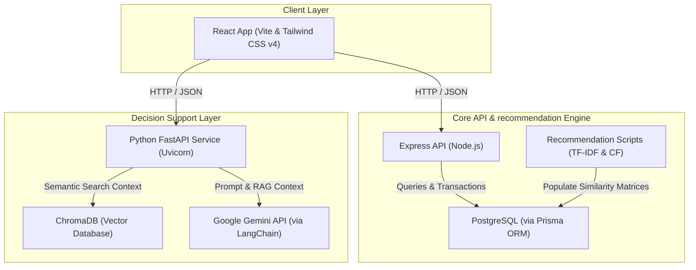

# NexCart - AI-Powered E-Commerce & Wholesaler Platform

NexCart is an advanced, production-grade e-commerce application designed to support Customers, Wholesalers, and System Administrators. The platform features a customized Hybrid Recommendation System, an AI-powered ledger digitizer (**AI Khatta**), and a Retrieval-Augmented Generation (RAG) **AI Business Advisor** chatbot.

---

## 1. System Architecture

NexCart runs as a multi-service web application composed of three main layers:



- **Frontend**: Written in React with Vite, styled with Tailwind CSS v4, and utilizing Zustand for global state management.
- **Backend API**: An Express application using Node.js, Prisma ORM, and PostgreSQL for customer transactions, wholesalers, orders, and local recommendation caching.
- **AI Service**: A Python FastAPI service that powers the RAG AI Business Advisor, storing source materials in ChromaDB and generating responses using Google Gemini models.

---

## 2. Directory Structure

```txt
NexCart_updated/
├── client/             # React frontend application
├── src/                # Express server source
├── prisma/             # Database schema and seeders
├── ai-service/         # Python FastAPI service & ChromaDB
├── docs/               # Technical reports & documentation
├── package.json        # Root-level unified scripts
└── README.md           # This file
```

---

## 3. Quick Start

1. **Automatic Launch**: Open the workspace in VS Code to trigger the backend and frontend servers automatically.
2. **Unified Command**: Run `pnpm run dev` in the root directory to start the entire stack:
   - **Backend Server** (Express)
   - **Frontend Dev Server** (Vite React)
   - **AI Service** (FastAPI)

---

## 4. Setup Guide

### 4.1 Web Application

1. **Install Dependencies**:
   ```bash
   pnpm install
   ```
2. **Database Setup**:
   ```bash
   pnpm prisma db push
   pnpm prisma generate
   pnpm run recommendations:seed-demo
   ```
3. **Start Development**:
   ```bash
   pnpm run dev
   ```
   - **Full Stack**: [http://localhost:5000](http://localhost:5000)
   - **Frontend (Vite)**: [http://localhost:5173](http://localhost:5173) (Proxied)
   - **API Health**: [http://localhost:5000/api/health](http://localhost:5000/api/health)

---

### 4.2 Docker (One-Command Setup)

If you have Docker and Docker Compose installed, you can launch the entire stack (including the database) with:

1. **Environment Configuration**: Ensure your root `.env` contains the necessary API keys.
2. **Launch**:
   ```bash
   docker-compose up --build
   ```
   - **Web App**: [http://localhost:5000](http://localhost:5000)
   - **AI Service**: [http://localhost:8000](http://localhost:8000)
   - **Database**: [http://localhost:5433](http://localhost:5433)
3. **Create and Activate Virtual Environment**:
   - **Windows (Command Prompt)**:
     ```cmd
     python -m venv .venv
     .venv\Scripts\activate
     ```
   - **Windows (PowerShell)**:
     ```powershell
     python -m venv .venv
     .venv\Scripts\activate.ps1
     ```
   - **Linux / macOS**:
     ```bash
     python3 -m venv .venv
     source .venv/bin/activate
     ```
4. **Install Requirements**:
   ```bash
   pip install -r requirements.txt
   ```
5. **Environment Configuration**:
   Create a `.env` file inside the `ai-service` directory matching [ai-service/.env](./ai-service/.env):
   ```properties
   LLM_PROVIDER=gemini
   GEMINI_API_KEY="your_gemini_api_key"
   GEMINI_MODEL=gemini-2.5-flash
   DOCS_PATH=./app/docs
   CHROMA_PATH=./chroma_db
   INGEST_MODE=replace
   EMBEDDING_MODEL=sentence-transformers/all-MiniLM-L6-v2
   MIN_RETRIEVAL_SCORE=0.55
   MAX_CITATIONS=5
   RETRIEVAL_TOP_K=5
   AI_CORS_ORIGINS=http://localhost:5173,http://localhost:4173
   ```
6. **Run Document Ingestion**:
   Load reference materials (such as the default [Shopify 101 Guide PDF](./ai-service/app/docs/Shopify%20101%20Complete%20Guide.pdf)) into the Chroma Vector Database:
   - Make sure uvicorn is running, or run the Python ingestion logic. You can start the server:
     ```bash
     uvicorn app.main:app --reload --port 8000
     ```
   - Trigger the ingestion API call:
     - Using terminal (PowerShell):
       ```powershell
       Invoke-RestMethod -Uri http://localhost:8000/ingest -Method Post
       ```
     - Using `curl` (Linux/macOS):
       ```bash
       curl -X POST http://localhost:8000/ingest
       ```

---

## 5. Main Features & Dashboards

- **Customer Storefront**: Interactive product browses, checkout tracking, and dynamic item similarity listings.
- **Wholesaler Dashboard**: Full analytics tracking ledger status, order fulfillment rates, and stock indices.
- **AI Khatta (Ledger Digitizer)**: Allows wholesalers to upload snapshots of handwritten receipts or ledger notes. Processes text and extract rows using Gemini vision prompts, which are then saved directly to the database.
- **AI Business Advisor**: LLM chatbot executing semantic retrieval (RAG) on stored business PDFs to assist wholesalers in scaling store inventory.
- **Hybrid Recommendation Analytics**: Dashboard monitoring click-through rates (CTR), purchase conversion percentages, catalog coverage, and evaluation benchmarks.

---

## 6. Advanced Documents Reference

For detailed mathematical algorithms, data schemas, sequence flows, or benchmarking explanations, please consult:

- [NexCart Recommendation System Final Report](./docs/recommendation-system-final-report.md)
- [Sample Recommendation Evaluation Report](./docs/sample-recommendation-evaluation-report.md)
