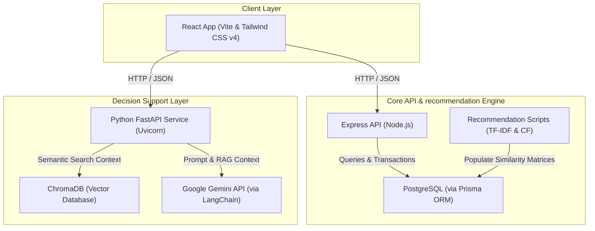

# NexCart - AI-Powered E-Commerce & Wholesaler Platform

NexCart is an advanced, production-grade e-commerce application designed to support Customers, Wholesalers, and System Administrators. The platform features a customized Hybrid Recommendation System, an AI-powered ledger digitizer (**AI Khatta**), and a Retrieval-Augmented Generation (RAG) **AI Business Advisor** chatbot.

---

## 1. System Architecture

NexCart runs as a multi-service web application composed of three main layers:



- **Frontend**: Written in React with Vite, styled with Tailwind CSS v4, and utilizing Zustand for global state management.
- **Backend API**: An Express application using Node.js, Prisma ORM, and PostgreSQL for customer transactions, wholesalers, orders, and local recommendation caching.
- **AI Service**: A Python FastAPI service that powers the RAG AI Business Advisor, storing source materials in ChromaDB and generating responses using Google Gemini models.

---

## 2. Directory Structure

```txt
NexCart_updated/
├── backend/            # Express server, Prisma schema, db seeders, recommendation jobs
├── frontend/           # React frontend application, store components, custom hooks
├── ai-service/         # Python FastAPI service, chroma vector database, ingestion docs
├── docs/               # Technical reports, mathematical formulas, and sample metrics
├── .vscode/            # Visual Studio Code tasks configuration for automatic launching
└── README.md           # Workspace-level overview and launch manual (This file)
```

---

## 3. Unified Quick Start (VS Code Tasks)

The project includes custom VS Code task profiles defined in [tasks.json](file:///c:/Users/smufa/Desktop/NexCart_updated/.vscode/tasks.json) to automate local server launch.

1. **Automatic Launch on Open**: When you open the workspace in Visual Studio Code, the workspace will automatically trigger:
   - **Start Backend Server** (Express)
   - **Start Frontend Server** (Vite React)
2. **AI Service Task**: Open the Command Palette (`Ctrl+Shift+P` on Windows/Linux or `Cmd+Shift+P` on macOS) and run `Tasks: Run Task` -> Select `Start AI Service`.
3. **Manual Launcher**: You can also select the compound task `Start All Services (FE + BE)` to start the backend and frontend simultaneously.

---

## 4. Service-by-Service Setup Guides

### 4.1 Backend (Express + Prisma + PostgreSQL)

1. **Navigate and Install**:
   ```bash
   cd backend
   npm install
   ```
2. **Environment Configuration**:
   Create a `.env` file inside the `backend` directory matching the variables from [backend/.env](file:///c:/Users/smufa/Desktop/NexCart_updated/backend/.env):
   ```properties
   DATABASE_URL="postgresql://postgres:<password>@localhost:5433/nexcart_db?schema=public"
   JWT_SECRET="your_secret_key"
   PORT=5000
   GEMINI_API_KEY="your_gemini_api_key"
   RAZORPAY_KEY_ID="rzp_test_..."
   RAZORPAY_KEY_SECRET="your_razorpay_secret"
   ```
3. **Apply Prisma Database Migrations**:
   Push the schema to your local PostgreSQL instance and generate the Prisma Client:
   ```bash
   npx prisma db push
   npx prisma generate
   ```
4. **Seed Demonstration Data**:
   ```bash
   npm run recommendations:seed-demo
   ```
5. **Pre-compute Similarity Matrices**:
   Build content-based and collaborative similarity matrices needed for hybrid recommendation queries:
   ```bash
   npm run recommendations:build-content
   ```
   _Note: Other jobs like collaborative filtering (`npm run recommendations:build-cf`) and popularity indices (`npm run recommendations:build-popularity`) should be run as active transactions and user interaction tracking data accumulate._
6. **Start Dev Server**:
   ```bash
   npm run dev
   ```
   The API will listen at [http://localhost:5000](http://localhost:5000).

---

### 4.2 Frontend (React + Vite)

1. **Navigate and Install**:
   ```bash
   cd frontend
   npm install
   ```
2. **Start Dev Server**:
   ```bash
   npm run dev
   ```
   The client application will run at [http://localhost:5173](http://localhost:5173).

---

### 4.3 AI Service (Python FastAPI + ChromaDB)

1. **Navigate and Install**:
   ```bash
   cd ai-service
   ```
2. **Create and Activate Virtual Environment**:
   - **Windows (Command Prompt)**:
     ```cmd
     python -m venv .venv
     .venv\Scripts\activate
     ```
   - **Windows (PowerShell)**:
     ```powershell
     python -m venv .venv
     .venv\Scripts\activate.ps1
     ```
   - **Linux / macOS**:
     ```bash
     python3 -m venv .venv
     source .venv/bin/activate
     ```
3. **Install Requirements**:
   ```bash
   pip install -r requirements.txt
   ```
4. **Environment Configuration**:
   Create a `.env` file inside the `ai-service` directory matching [ai-service/.env](file:///c:/Users/smufa/Desktop/NexCart_updated/ai-service/.env):
   ```properties
   LLM_PROVIDER=gemini
   GEMINI_API_KEY="your_gemini_api_key"
   GEMINI_MODEL=gemini-3.5-flash
   DOCS_PATH=./app/docs
   CHROMA_PATH=./chroma_db
   INGEST_MODE=replace
   EMBEDDING_MODEL=sentence-transformers/all-MiniLM-L6-v2
   MIN_RETRIEVAL_SCORE=0.55
   MAX_CITATIONS=5
   RETRIEVAL_TOP_K=5
   AI_CORS_ORIGINS=http://localhost:5173,http://localhost:4173
   ```
5. **Run Document Ingestion**:
   Load reference materials (such as the default [Shopify 101 Guide PDF](file:///c:/Users/smufa/Desktop/NexCart_updated/ai-service/app/docs/Shopify%20101%20Complete%20Guide.pdf)) into the Chroma Vector Database:
   - Make sure uvicorn is running, or run the Python ingestion logic. You can start the server:
     ```bash
     uvicorn app.main:app --reload --port 8000
     ```
   - Trigger the ingestion API call:
     - Using terminal (PowerShell):
       ```powershell
       Invoke-RestMethod -Uri http://localhost:8000/ingest -Method Post
       ```
     - Using `curl` (Linux/macOS):
       ```bash
       curl -X POST http://localhost:8000/ingest
       ```

---

## 5. Main Features & Dashboards

- **Customer Storefront**: Interactive product browses, checkout tracking, and dynamic item similarity listings.
- **Wholesaler Dashboard**: Full analytics tracking ledger status, order fulfillment rates, and stock indices.
- **AI Khatta (Ledger Digitizer)**: Allows wholesalers to upload snapshots of handwritten receipts or ledger notes. Processes text and extract rows using Gemini vision prompts, which are then saved directly to the database.
- **AI Business Advisor**: LLM chatbot executing semantic retrieval (RAG) on stored business PDFs to assist wholesalers in scaling store inventory.
- **Hybrid Recommendation Analytics**: Dashboard monitoring click-through rates (CTR), purchase conversion percentages, catalog coverage, and evaluation benchmarks.

---

## 6. Advanced Documents Reference

For detailed mathematical algorithms, data schemas, sequence flows, or benchmarking explanations, please consult:

- [NexCart Recommendation System Final Report](file:///c:/Users/smufa/Desktop/NexCart_updated/docs/recommendation-system-final-report.md)
- [Sample Recommendation Evaluation Report](file:///c:/Users/smufa/Desktop/NexCart_updated/docs/sample-recommendation-evaluation-report.md)
