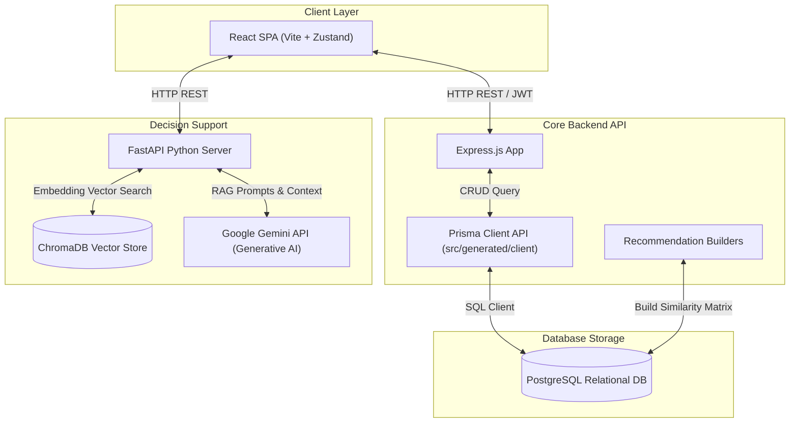
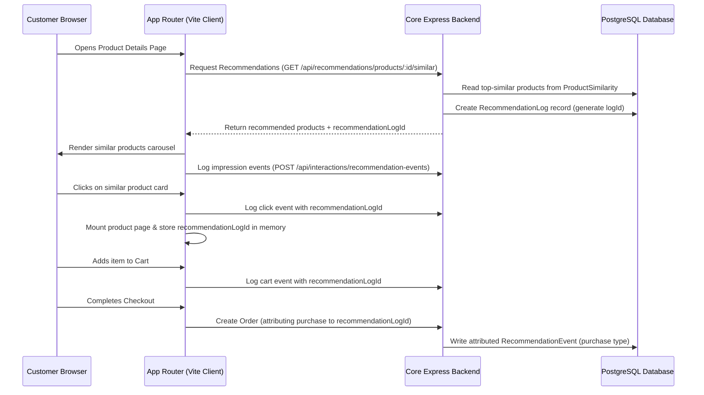

# NexCart System Architecture Guide

This document describes the structural design, backend data mapping, and API routing architecture of the NexCart e-commerce and wholesaler platform.

---

## 1. System Layers & Data Flow

NexCart is structured as a decoupled, multi-tier application connecting front-end UI clients with transactional relational databases and a vector-based semantic retrieval service.

---

## 2. Database Design & Models

The relational database is managed via [schema.prisma](../prisma/schema.prisma) and deployed on PostgreSQL. Key database models and relationships include:

### 2.1 Core Identity & Roles

- **User**: Handles authentication and account management. Has a unique `email` and password. Divides users into one of three roles:
  - `CUSTOMER`: Accesses storefront views, browse suggestions, builds shopping carts, and creates purchases.
  - `WHOLESALER`: Links to a unique **Wholesaler** profile. Manages product inventories, reviews ledger states, and launches the RAG Business Advisor.
  - `SUPER_ADMIN`: Monitors system statistics, offline recommendation quality reports, and clears system cache indices.
- **Wholesaler**: Stores business profiles (e.g. `businessName`). Coordinates relationships with `Product` arrays, `Order` items, `LedgerEntry` summaries, and `InventoryLog` records.

### 2.2 Inventory & E-Commerce Flow

- **Product**: Contains item metadata (name, description, category, size list, stock counts, cost metrics, and prices). Linked to a parent `Wholesaler` provider.
- **InventoryLog**: Tracks stock adjustments. Logs changes with custom types: `SALE`, `REFUND`, `OCR_UPDATE` (from AI Khatta scanner), `MANUAL_ADJUSTMENT`, `CANCELLATION`, or `CUSTOMER_RETURN`.
- **Order & OrderItem**: Records buyer-seller checkouts. Tracks `paymentStatus` (COD, Prepaid) and order fulfillment status (PENDING, PROCESSING, SHIPPED, DELIVERED, CANCELLED).
- **LedgerEntry**: Records accounting histories between a wholesaler and a customer. Tracks credits and debits (`amount`).

### 2.3 Recommendation Attribution Data Models

- **RecommendationInteraction**: Logs individual customer interactions (action types: `view`, `wishlist`, `cart`, `purchase`, `review`). Attributes impressions to a specific recommendation instance via `recommendationId`.
- **ProductFeature**: Stores parsed text corpora (product names, category, size variables) and corresponding pre-computed TF-IDF JSON vectors.
- **ProductSimilarity**: Contains pre-calculated likeness indexes between products, computed using content-based filtering or item collaborative models.
- **RecommendationLog & RecommendationEvent**: Tracks recommendations rendered on the client storefront. Measures event streams (impressions, clicks, add-to-carts, purchases) to calculate CTR and sales conversions.

---

## 3. Core REST API Route Map

### 3.1 Express Backend Routes

All backend routes are prefix-mapped under `/api` inside [index.js](../src/index.js):

| Resource Endpoint          | Middleware / Auth     | Controller Logic              | Description                                                                     |
| :------------------------- | :-------------------- | :---------------------------- | :------------------------------------------------------------------------------ |
| **`/api/auth`**            | Public                | `authController.js`           | Handles user registration, JWT login, and session validation.                   |
| **`/api/products`**        | Mixed Auth            | `productController.js`        | Fetches listings, reviews, and wholesaler inventories.                          |
| **`/api/inventory`**       | Wholesaler            | `inventoryController.js`      | Modifies product stock levels and appends `InventoryLog` entries.               |
| **`/api/orders`**          | Customer / Wholesaler | `orderController.js`          | Submits checkouts, initializes payments (Razorpay), and handles order issues.   |
| **`/api/ledger`**          | Wholesaler            | `ledgerController.js`         | Fetches transactional ledgers for customer accounts.                            |
| **`/api/khatta`**          | Wholesaler            | `khattaController.js`         | Parses handwritten receipts and saves them as transaction lines.                |
| **`/api/recommendations`** | Customer / Wholesaler | `recommendationController.js` | Returns popular list, similar items, custom customer feed, and offline reports. |

### 3.2 Python AI Service Routes

- **`POST /chat`**: Receives customer query, session identifier, and company statistics context. Classified by prompt rules, executes ChromaDB semantic search, and compiles RAG results from Google Gemini LLM.
- **`POST /ingest`**: Reads PDF documents from `DOCS_PATH`, segments text into chunks using `RecursiveCharacterTextSplitter` (chunk size: 800, overlap: 100), builds embeddings (`sentence-transformers/all-MiniLM-L6-v2`), and indexes them in ChromaDB.
- **`GET /history`**: Returns historical query buffers associated with the user session.

---

## 4. Operational Flows

### 4.1 Recommendation Lifecycle & Event Attribution

