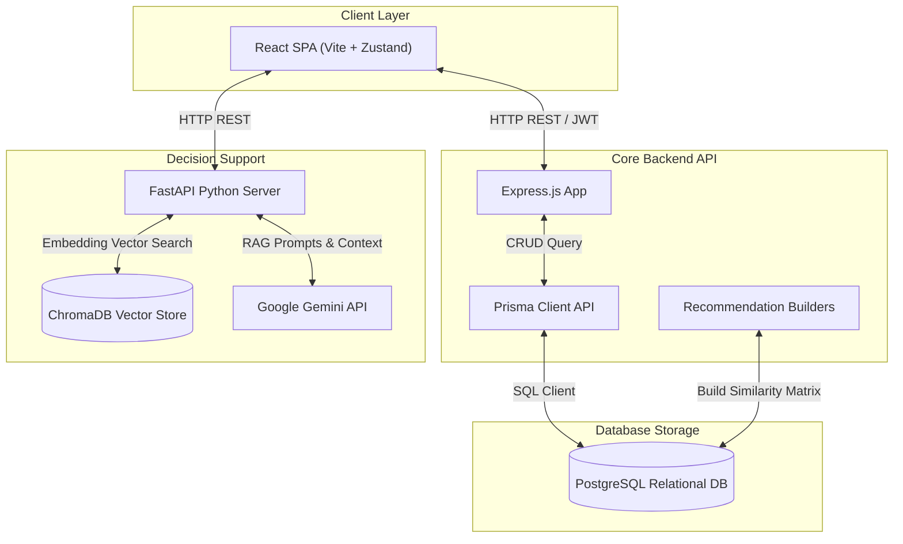
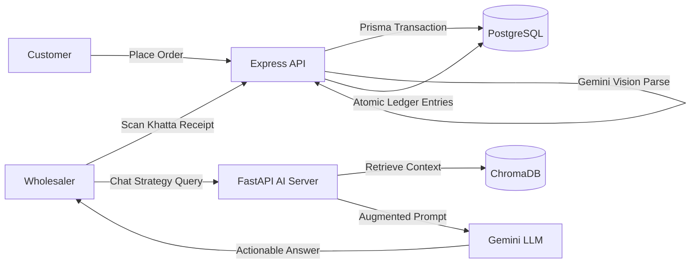

# Chapter 3: System Requirements

### 3.1 Functional Requirements

#### 3.1.1 Customer Requirements

The customer storefront is the core B2C consumer-facing interface. The system must support the following features:

- **User Registration & Authentication**: Customers must register with a unique email and password. Upon logging in, they receive a signed JWT token used to authenticate subsequent API requests.
- **Catalog Browsing**: Customers can browse the product catalog, filter listings by category (e.g., Grocery, Electronics, Apparel, etc.), and search for items by name or description.
- **Personalization Feed**: The storefront must display three carousels:
  - _Trending Listings_: Popular products calculated using time-decay popularity scoring.
  - _Personalized Feed_: Products suggested based on the customer's historical interactions.
  - _Similar Products_: Displayed on product details pages to show related items.
- **Shopping Cart Management**: Customers can add items to their carts, adjust quantities, and remove items. Carts must remain isolated to the logged-in customer.
- **Checkout Flow**: The cart checkout must support:
  - _Online Prepaid Checkout_: Secure payment processing using the Razorpay gateway modal.
  - _Cash on Delivery (COD)_: Orders placed without upfront payment, setting the payment status to `PENDING`.
- **Claims & Returns Portal**: Customers can view past orders, track delivery status, and request returns for delivered items. The request requires selecting return quantities and entering return reasons.

#### 3.1.2 Wholesaler Requirements

Wholesalers manage inventory and accounting via a dedicated dashboard. The system must support:

- **Product Catalog Management (CRUD)**: Wholesalers can create, read, update, and delete product listings, including retail prices, cost prices, categories, sizes, and stock counts.
- **Stock Adjustments Log**: Every stock adjustment must record a reason (e.g., `MANUAL_ADJUSTMENT`, `OCR_UPDATE`, `REFUND`), which is saved to the database for audit tracking.
- **Credit Ledger Bookkeeping**: Wholesalers must be able to view customer credit ledgers. They can log manual entries or view auto-settled transactions.
- **AI Khatta OCR Receipt Scanner**: Wholesalers can upload photos of physical ledger pages to parse names, amounts, and notes.
- **AI Business Advisor Console**: Wholesalers can input strategy questions and receive advice based on uploaded PDF guides.

#### 3.1.3 Super Admin Requirements

System administrators manage system settings and monitor performance:

- **Recommendation Dashboard**: Tracks recommendation performance (CTR, Cart Add Rates, Conversion Rates, Catalog Coverage).
- **Offline Benchmarks**: Admins can trigger evaluation scripts to generate Precision, Recall, and NDCG reports.
- **System Maintenance**: Admins can clear log databases, reset analytics metrics, and recalculate similarity indices.

---

### 3.2 Non-Functional Requirements

#### 3.2.1 Security & Access Control

- **JWT Authentication**: All private requests require a valid JWT header.
- **Role-Based Access Control (RBAC)**: Backend resources must restrict access using role guards (`requireWholesaler`, `requireSuperAdmin`).
- **Data Isolation**: Customers must not have access to other users' shopping carts, order histories, or credit ledgers.

#### 3.2.2 Data Consistency & Transactional Safeguards

- **Atomic Inventory Reservation**: During checkout, product stock levels must decrement atomically to prevent overselling.
- **Signature Verification Idempotency**: Payment gateways must process transactions idempotently to avoid duplicate order generation.
- **Deduplication**: Ledger entries must use unique idempotency keys to block duplicate entries from network retries.

#### 3.2.3 Latency & Performance

- **Recommender Speed**: recommended carousels must render within 100ms.
- **RAG Query Speed**: AI advisor chatbot must respond within 2 seconds.

---

### 3.3 Use Case Modeling

#### 3.3.1 Customer Use Cases

- **Log In**: User inputs email and password $\rightarrow$ Server validates credentials $\rightarrow$ Returns JWT session token.
- **Browse Catalog**: User views home screen $\rightarrow$ Server returns customized products carousels based on user profile.
- **Add to Cart**: User clicks "Add to Cart" on a product card $\rightarrow$ Server verifies cart ownership and updates quantities.
- **Checkout Order**: User submits checkout request $\rightarrow$ Server starts a transaction, updates stock levels, and records order details.
- **Request Return**: User submits return request for a delivered item $\rightarrow$ Server updates item status to `RETURN_REQUESTED`.

#### 3.3.2 Wholesaler Use Cases

- **Manage Product Catalog**: Wholesaler performs CRUD operations on products $\rightarrow$ Server validates wholesaler role and updates records.
- **Adjust Stock**: Wholesaler modifies stock levels $\rightarrow$ Server updates inventory and logs changes to `InventoryLog`.
- **Scan Receipt**: Wholesaler uploads a receipt photo $\rightarrow$ Server extracts transaction details and updates ledgers.
- **Consult Advisor**: Wholesaler inputs strategy question $\rightarrow$ Server retrieves context from database and generates advice.

#### 3.3.3 System Administrator Use Cases

- **View Recommendation Analytics**: Admin monitors CTR, conversion rates, and catalog coverage metrics.
- **Run Offline Evaluations**: Admin triggers recommender benchmark script to generate performance reports.
- **Clear Caches**: Admin resets analytics metrics and database caches.

---

---

# Chapter 4: System Architecture & Design

### 4.1 Architectural Pattern & Structural Overview

NexCart is structured as a decoupled, three-tier architecture:

- **Presentation Layer**: React 19 frontend SPA.
- **Service Layer**: Express.js REST API gateway connected to Prisma ORM.
- **AI Service Layer**: FastAPI Python service handling ChromaDB indices and Gemini LLM prompts.

---

### 4.2 System Architecture Flowcharts

#### 4.2.1 High-Level Architecture Block Diagram

#### 4.2.2 System Data Flow Flowchart

---

### 4.3 Backend API & Sequence Architecture

#### 4.3.1 Restful API Endpoint Mapping Table

| HTTP Method | Route                        | Controller                    | Auth Middleware     | Functionality                                         |
| :---------- | :--------------------------- | :---------------------------- | :------------------ | :---------------------------------------------------- |
| **POST**    | `/api/auth/register`         | `authController.js`           | Public              | Registers customers or wholesalers                    |
| **POST**    | `/api/auth/login`            | `authController.js`           | Public              | Returns signed JWT for authenticated sessions         |
| **GET**     | `/api/products`              | `productController.js`        | Mixed               | Lists items; filters by category or search term       |
| **POST**    | `/api/inventory/adjust`      | `inventoryController.js`      | `requireWholesaler` | Modifies item stocks and appends `InventoryLog`       |
| **POST**    | `/api/orders/checkout`       | `orderController.js`          | `authenticate`      | Processes checkout and updates database inventory     |
| **POST**    | `/api/orders/verify-payment` | `orderController.js`          | `authenticate`      | Verifies Razorpay signature using webhook credentials |
| **GET**     | `/api/cart`                  | `cartController.js`           | `authenticate`      | Returns authenticated customer's cart                 |
| **POST**    | `/api/khatta/process`        | `khattaController.js`         | `requireWholesaler` | Parses billing books using Gemini Vision models       |
| **GET**     | `/api/recommendations/user`  | `recommendationController.js` | `authenticate`      | Returns hybrid recommendations feed                   |

#### 4.3.2 Session Management & Middleware Guard Sequences

Sessions are stateless and secured with JWT. When a request is received, the `authenticate` middleware checks the `Authorization: Bearer <token>` header, decodes the signature, and attaches the payload (`req.user = decoded`). Subsequent route guards (`requireWholesaler` or `requireSuperAdmin`) check the role field, returning a `403 Forbidden` status code if permissions are insufficient.

---

### 4.4 Transactional & Concurrency Design

#### 4.4.1 Concurrency Design for Checkouts (Atomic Conditional Database Updates)

To prevent overselling under high concurrent traffic, checkout operations execute inside a transaction. The inventory count is decremented conditional on sufficient stock remaining:

1.  Initiate transaction: `prisma.$transaction(...)`
2.  Query product quantity: `SELECT stock FROM Product WHERE id = :productId`
3.  Verify condition: `if (stock < requestedQuantity) throw Error("Insufficient Stock")`
4.  Update stock: `UPDATE Product SET stock = stock - :requestedQuantity WHERE id = :productId`
5.  If any item in the cart fails the condition, the transaction rolls back, releasing database locks.

#### 4.4.2 Payment Verification & Order Placement Idempotency Flow

When a user pays via Razorpay, network timeouts may trigger repeated verification requests. NexCart resolves this by setting the Razorpay Payment ID as a unique identifier.

1.  Read incoming `razorpayPaymentId`.
2.  Query `Order` database for an entry containing the payment ID.
3.  If an order is found: Return the existing order record (skip creation).
4.  If not found: Create the order and log the transaction.

#### 4.4.3 COD Auto-Settlement Unique Constraint De-duplication Flow

When a wholesaler marks a Cash on Delivery (COD) order as `DELIVERED`, the ledger must be updated automatically.

1.  A settlement entry is created with an idempotency key: `order-auto-payment:<orderId>`.
2.  A database unique constraint is set on `LedgerEntry.idempotencyKey`.
3.  If concurrent status updates occur, database engines catch the constraint violation, allowing only one ledger record to be created without throwing fatal runtime exceptions.
