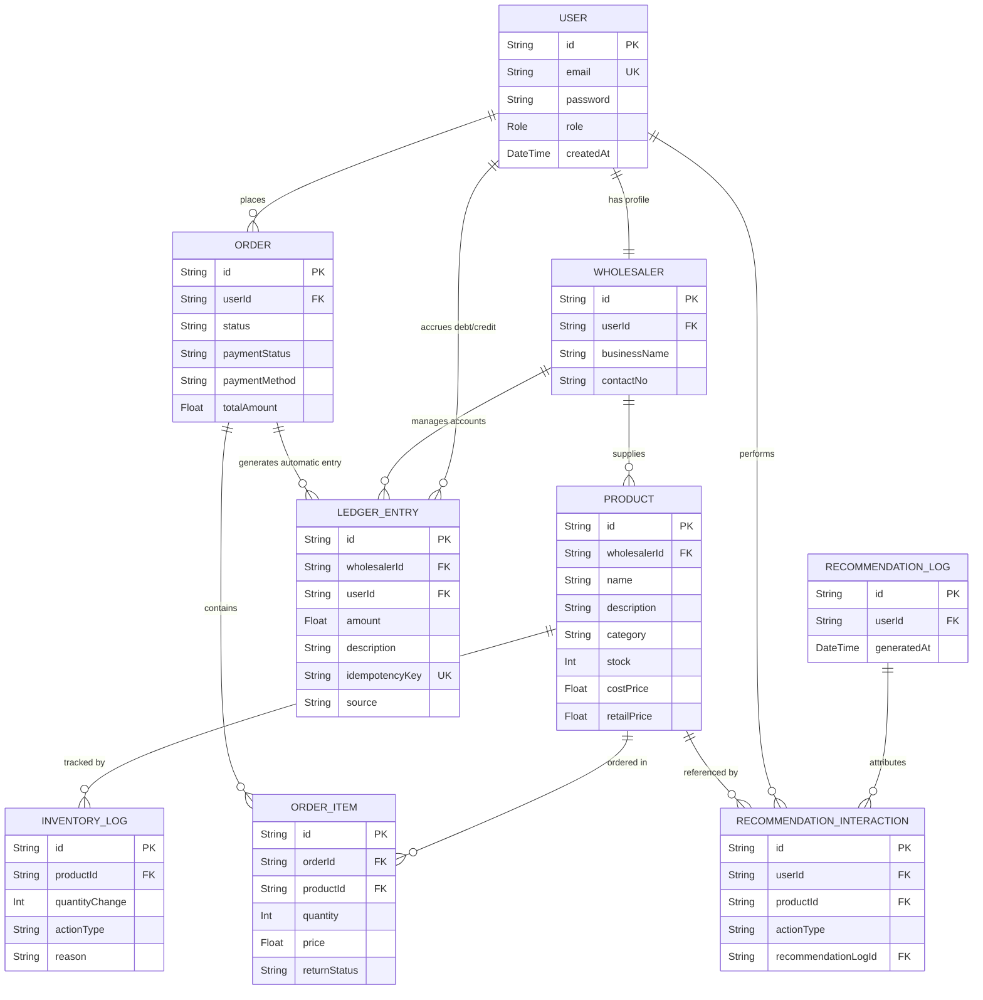
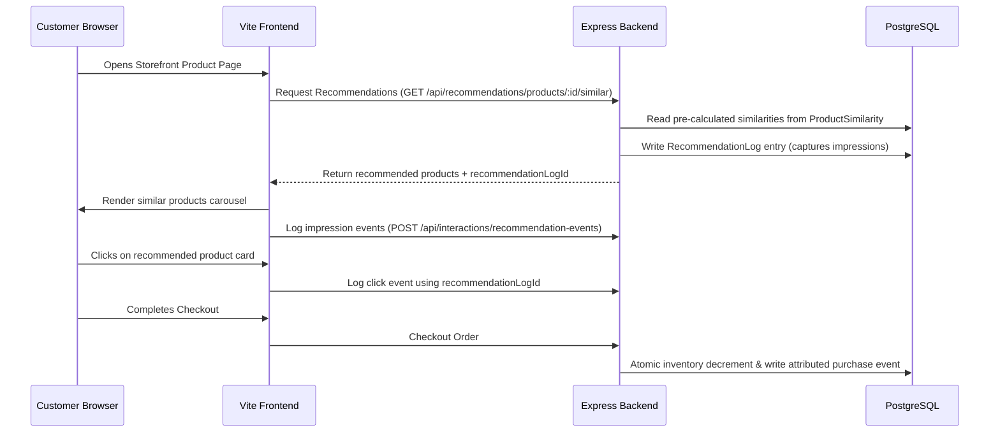
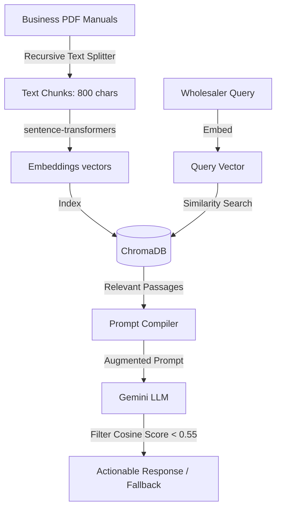
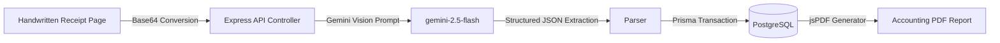

# Chapter 5: Relational Database Schema & ER Design

### 5.1 Relational Database Schema Design (Prisma / PostgreSQL)

The database structure of NexCart is managed through Prisma ORM and deployed on a relational PostgreSQL database engine. The system requires relational tables to track core identity profiles, inventory levels, sales checkout history, credit balances, and recommended impression flows.

#### 5.1.1 Users, Profiles, and Wholesaler Constraints

- **User**: Handles session profiles and logins. It contains an `email` (string, unique), hashed `password`, and a role field which defaults to `CUSTOMER` but can be flagged as `WHOLESALER` or `SUPER_ADMIN`.
- **Wholesaler**: Stores wholesale business configurations. It has a one-to-one relationship with `User` (`userId` refers to `User.id`). It maps parameters like `businessName`, `contactNo`, and references product catalogs.

#### 5.1.2 Inventory and Transactions (InventoryLog, LedgerEntry)

- **Product**: Tracks individual item configurations. It links to a parent `Wholesaler` provider and maps `name`, `description`, `category`, `stock` (integer), `costPrice` (float), `retailPrice` (float), and supported sizes.
- **InventoryLog**: Records stock count adjustments. It stores `productId` (foreign key pointing to `Product`), `quantityChange` (positive or negative integer), `actionType` (enum: `SALE`, `REFUND`, `OCR_UPDATE`, `MANUAL_ADJUSTMENT`, `CANCELLATION`, etc.), and a short description.
- **LedgerEntry**: Records outstanding debt balances. It links a `Wholesaler` to a target customer `User`. It contains transaction `amount` (negative for customer debt), a description note, a deterministic `idempotencyKey`, and a `source` flag.

#### 5.1.3 Order Management (Orders, OrderItems, Returns, and Reversals)

- **Order**: Records checkout sessions. It stores `userId` (customer ID), order status (`PENDING`, `PROCESSING`, `SHIPPED`, `DELIVERED`, `CANCELLED`), payment status (`PAID`, `PENDING`), payment method (`COD`, `PREPAID`), and `totalAmount`.
- **OrderItem**: Maps items in an order. It stores `orderId`, `productId`, `quantity`, `price`, and returns metadata (`returnStatus`, `refundAmountSnapshot`, `returnedQuantity`).

#### 5.1.4 Recommendation Log, Impressions, and Events

- **RecommendationLog**: Logs recommended lists shown to users. It contains `userId` and timestamps.
- **RecommendationInteraction**: Tracks individual interaction logs (action types: `view`, `wishlist`, `cart`, `purchase`, `review`).

---

### 5.2 Entity-Relationship (ER) Diagram



---

---

# Chapter 6: Core AI Engines & Lifecycles

### 6.1 Hybrid Recommendation Engine Implementation

NexCart builds a consolidated rank list by scoring and weighting three algorithms.

```
Hybrid Score Formula:
  Score = (ContentSimilarity * 0.45) + (CollaborativeScore * 0.30) + (PopularityScore * 0.20) + (ReviewQuality * 0.05)
```

#### 6.1.1 Preprocessing and Corpus Assembly

Product metadata (name, category, description, sizes, and wholesaler name) is lowercased and stripped of non-alphanumeric characters. Words with a length of 2 characters or fewer are filtered out.

#### 6.1.2 Calculating TF-IDF and Cosine Similarity

- **Term Frequency (TF)**: $tf(t, d) = \frac{\text{Count}(t)}{\text{Total Terms in } d}$
- **Inverse Document Frequency (IDF)**: $idf(t) = \log\left(\frac{N + 1}{df(t) + 1}\right) + 1$
- **Cosine Similarity**: $\text{similarity}(A, B) = \frac{A \cdot B}{\|A\| \|B\|}$
  The top-K similar products are stored in the `ProductSimilarity` database table.

#### 6.1.3 Collaborative Filtering Matrix Calculations

Item-based collaborative filtering calculates correlations between products based on historical user interactions (views, add-to-carts, purchases). Users are represented as vectors across the item space. The Pearson correlation or cosine likeness is calculated between item interaction vectors to suggest products related to those in the user's cart or history.

#### 6.1.4 Exponential Time-Decay Popularity Math

To prevent recommendations from becoming static, popularity scores are decayed over time:
$$\text{PopularityScore} = \sum (\text{ActionWeight} \times \text{Quantity}) \times 0.5^{\frac{\text{AgeDays}}{\text{HalfLife}}}$$

- Action weights: `purchase` = 1.0, `cart` = 0.5, `view` = 0.1.
- HalfLife is configured to 7 days.

#### 6.1.5 Weighted Score Synthesis & Attribution Pipeline

The hybrid recommender queries products matching the computed indices, normalizes each algorithm's score to a 0..1 scale, applies weights, and ranks the candidates. The rendered list and its allocation ID are stored in the database.

#### 6.1.6 Recommendation Lifecycle Sequence Flowchart



---

### 6.2 AI Business Advisor Implementation (RAG Agent)

The RAG pipeline is built inside the `ai-service` folder.

#### 6.2.1 Vector Store Ingestion (Recursive Character Splitting & Embeddings)

Business manuals (PDFs) are read, parsed, and split using a LangChain character splitter (chunk size: 800 characters, overlap: 100). The splitter creates overlapping segments to preserve text context.

#### 6.2.2 Semantic Search Ingestion in ChromaDB

Segments are processed into vector embeddings using the `sentence-transformers/all-MiniLM-L6-v2` model. The generated coordinate matrices are stored and indexed in a local ChromaDB instance.

#### 6.2.3 Context Synthesis and Response Compilation via Gemini

When a user asks a question, the query is embedded and matched against ChromaDB using cosine similarity. The system extracts the top-K text chunks and includes them in the prompt sent to Google Gemini (`gemini-2.5-flash`). This limits the model's response to facts found in the reference documents.

#### 6.2.4 Low-Confidence Fallback Thresholding (Score < 0.55)

To prevent hallucinations on out-of-domain queries, the system checks the similarity score of the top retrieved text chunk. If the score is below 0.55, the chatbot bypasses the LLM call and returns a pre-configured fallback message: _"I'm sorry, I cannot find relevant information in my business guides to answer this query."_

#### 6.2.5 RAG Query and Execution Flowchart



---

### 6.3 AI Khatta Digitizer Implementation (Vision Scan)

The AI Khatta tool automates digitizing billing records.

#### 6.3.1 Image Conversion & base64 Processing

Handwritten billing page photos are sent as base64 data to the Express controller `src/controllers/khattaController.js`. The server processes the binary stream and validates its size before sending it to the model.

#### 6.3.2 Strict Prompt Extraction and JSON Mapping

The Express API calls `gemini-2.5-flash` with the image and a strict extraction prompt:

```
Analyze this billing record image. Identify rows showing transaction details.
For each row, output a JSON object mapping:
- email: Estimated email address of the customer
- amount: Float value (negative for debt owed to the wholesaler)
- notes: Short summary of items bought or reasons
Return only a JSON array of these objects.
```

#### 6.3.3 Database Ledger Transaction & PDF Invoice Generation (jsPDF)

The server validates the model's JSON output. It opens a database transaction to verify that each customer's email exists, and creates the corresponding `LedgerEntry` records. The system then uses `jspdf` and `jspdf-autotable` to format the verified ledger entries into a styled PDF report.

#### 6.3.4 Vision Scanner Ingestion and Ledger Entry Flowchart


