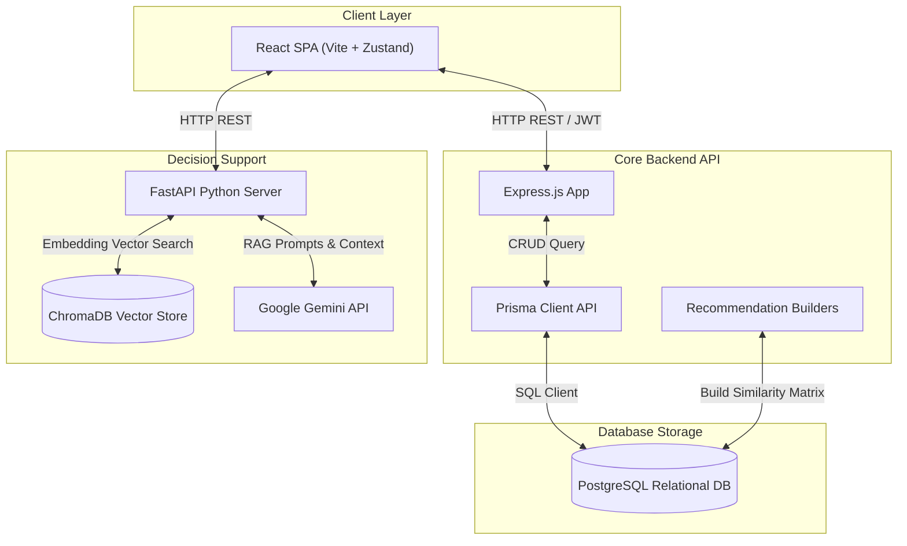
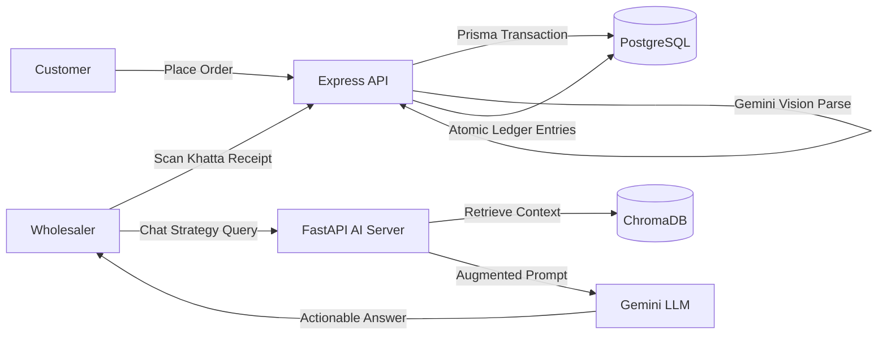
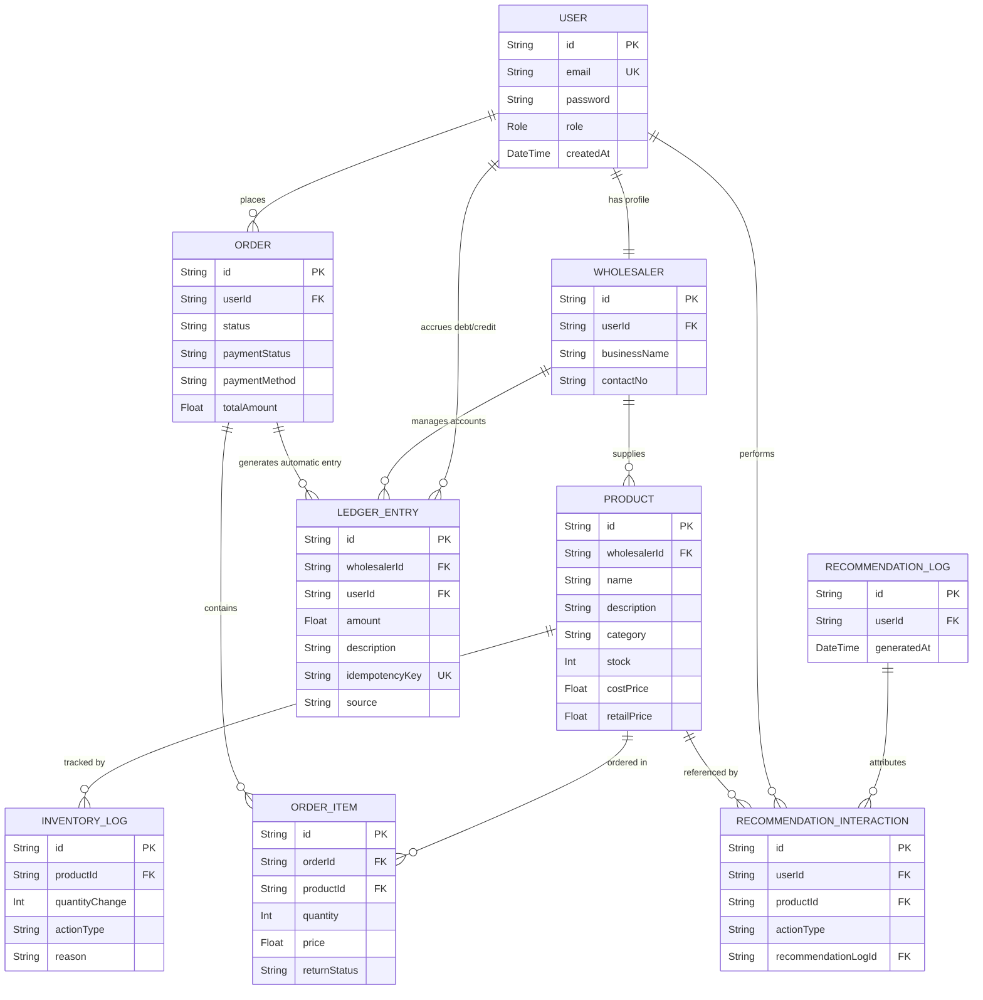
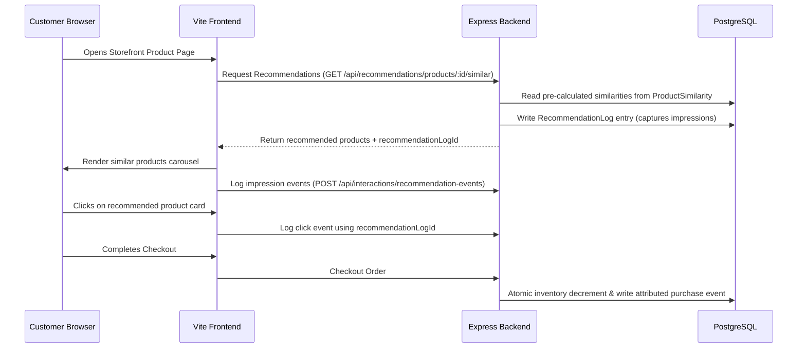
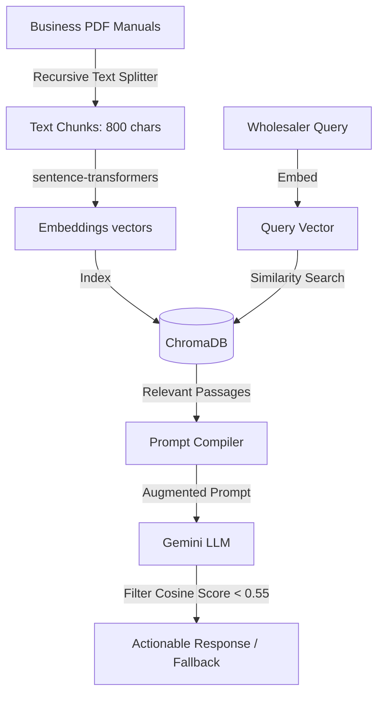

# Chapter 1: Introduction

### 1.1 Project Overview & Motivation

The digital commerce landscape has experienced unprecedented growth over the last two decades. While business-to-consumer (B2C) systems have received significant research and development—resulting in advanced personalization engines, headless checkout pipelines, and real-time behavioral tracking—the business-to-business (B2B) wholesale sector has lagged behind. Wholesalers form the backbone of the supply chain, supplying inventory to small and medium enterprises (SMEs), local mom-and-pop stores, and independent retailers. Despite their economic importance, many wholesalers continue to use legacy processes.

A primary example is credit accounting. Unlike standard retail checkouts where transactions are settled immediately using cash or credit cards, wholesale commerce operates on credit lines. Wholesalers extend short-term credit to trusted, regular retail buyers. Historically, these transactions have been recorded in physical paper notebooks, commonly known in South Asian markets as _Khatta books_. While paper bookkeeping is simple, it presents several issues:

- **Physical Vulnerability**: Paper books are susceptible to water damage, fire, structural wear, or loss.
- **Operational Errors**: Manual calculations of credits, debits, and balance carries often lead to mathematical errors and customer disputes.
- **No Remote Access**: Retailers cannot check their balance records or payment history without visiting the wholesaler.
- **No Business Intelligence**: Physical notebooks store transactional history as flat text, making it impossible to analyze sales trends, predict cash flows, or optimize credit risk limits.

Additionally, small and medium-sized wholesalers struggle to adopt modern e-commerce tools:

- **Recommendation Systems**: Without personalized product suggestions, wholesalers cannot easily cross-sell inventory, leaving low-demand products sitting in warehouses.
- **Operational Scaling**: Wholesalers lack data-driven consulting resources to advise them on marketing, logistics, and pricing strategies.

The **NexCart** platform was developed to solve these issues. NexCart is an AI-powered B2B and B2C e-commerce platform that combines storefront personalization with bookkeeping and business intelligence tools for wholesalers. NexCart introduces three major features:

1.  **A Hybrid Recommendation Engine**: Integrates TF-IDF content similarity, item-based collaborative filtering, and time-decay popularity rankings to provide personalized storefront suggestions.
2.  **An AI Khatta Digitizer**: Uses multimodal Vision LLMs (Google Gemini) to parse photos of handwritten billing books, extract structured JSON data, and write transaction records directly to a database inside secure Prisma transactions.
3.  **An AI Business Advisor**: A FastAPI RAG agent that retrieves relevant passages from indexed business playbooks (such as logistics manuals or marketing guides) to answer wholesaler strategy queries using Gemini, using a cosine similarity safety threshold to prevent hallucinations.

---

### 1.2 Problem Statement

#### 1.2.1 Friction in Wholesaler-Customer Credit Accounting (Ledger Bookkeeping)

Traditional B2B credit bookkeeping relies on manual entry into paper notebooks. This approach has several issues:

- **High Bookkeeping Overhead**: Wholesalers spend hours at the end of each day manually calculating totals and outstanding balances for dozens of accounts.
- **Lack of Audit Traceability**: When stock is adjusted or cash payments are made, physical ledgers lack audit trails tracking why changes occurred, leading to accountability issues.
- **Lack of Customer Self-Service**: Customers have no way to verify their ledger balances or check invoice details remotely, leading to administrative overhead from balance inquiries.

#### 1.2.2 Cold-Start and Relevance Issues in Product Recommendation Systems

Recommender systems are critical for driving sales conversions. However, standard models have significant limitations:

- **Collaborative Filtering Cold-Start**: Collaborative filtering models require user interaction logs to function. New products or users with no history receive no recommendations, leading to a cold-start issue.
- **Content-Based Overspecialization**: Content filtering recommends items matching existing user tastes, but fails to show popular trending products or introduce new categories.
- **Query Performance Overhead**: Calculating item similarity matrices on-the-fly during page loads can lock database records and slow storefront performance.

#### 1.2.3 Operational Scaling Hurdles for Wholesalers

Wholesalers face challenges when trying to grow their operations:

- **High Consulting Costs**: Small business owners cannot afford professional strategy consultants to help plan inventory levels, design marketing campaigns, or optimize logistics.
- **Hallucination in General AI Models**: Public LLMs often provide generic or incorrect advice on logistics and market regulation because they are not grounded in verified commerce documentation.
- **Information Ingestion Barriers**: Wholesalers lack the time to read long PDF business manuals and extract actionable insights.

---

### 1.3 Project Goals & Objectives

The primary goal of NexCart is to create a secure, scalable, and AI-enabled B2B & B2C e-commerce platform. The specific objectives include:

1.  **Build a Decoupled Multi-Tier Platform**: Connect a React 19 frontend SPA, an Express.js API gateway, a Prisma ORM/PostgreSQL database, and a FastAPI RAG service.
2.  **Deploy a Latency-Safe Recommender**: Pre-compute hybrid recommendations combining TF-IDF content similarity, collaborative user behaviors, and exponential popularity decay to keep storefront response times under 100ms.
3.  **Build a Vision-Based Ledger Scanner**: Develop a multimodal parser that processes receipt images, extracts JSON structured transaction lines, and updates ledgers inside secure transactions.
4.  **Create a Verified RAG Chatbot**: Build a Retrieval-Augmented Generation agent with a 0.55 cosine similarity confidence threshold to filter out irrelevant or hallucinatory advice.
5.  **Ensure Transactional Integrity**: Build backend checks to guarantee atomic inventory checkouts, payment verification idempotency, and automated ledger settlements.

---

### 1.4 Report Organization

This document describes the design, implementation, and testing of NexCart:

- **Chapter 2 (Literature Review & Technology Stack)** reviews the theoretical background of modern architectures, recommender algorithms, RAG, OCR/Vision systems, and justifies the chosen tech stack.
- **Chapter 3 (System Requirements)** defines functional and non-functional requirements.
- **Chapter 4 (System Architecture & Design)** details system layers, data flows, and REST endpoints.
- **Chapter 5 (Relational Database Schema & ER Design)** displays the database model structure, Prisma schemas, and entity relationships.
- **Chapter 6 (Core AI Engines & Lifecycles)** provides the math formulas, coding logic, and flows for the recommender, RAG agent, and vision parser.
- **Chapter 7 (User Interface Design & User Flows)** outlines storefront, wholesaler, and admin user screens.
- **Chapter 8 (Testing, Evaluation, and Results)** contains the empirical measurements, benchmark logs, and concurrency test results.
- **Chapter 9 (Conclusion & Future Scope)** summarizes the project contributions, system limits, and future research work.

---

---

# Chapter 2: Literature Review & Technology Stack

### 2.1 E-Commerce Architectures and Patterns

Historically, e-commerce applications were built as monoliths, where client layouts, business rules, and database queries lived in a single server process. While easy to build initially, monoliths suffer from serious scalability issues. A spike in client views can degrade database queries, and a failure in one component can crash the entire system.

Modern software patterns separate concerns by using decoupled, multi-tier architectures. By separating client interfaces (React SPA) from API gateways (Express API) and data-intensive AI processes (FastAPI Python), systems run in isolated processes that scale independently. Communication occurs over lightweight HTTP REST and JWT protocols.

---

### 2.2 Theoretical Foundations of Recommendation Systems

#### 2.2.1 Content-Based Filtering (TF-IDF and Cosine Similarity)

Content-based recommenders recommend items similar to those a user previously bought or viewed. This requires converting item text metadata into numerical vectors.

- **Term Frequency-Inverse Document Frequency (TF-IDF)**: Computes word weights by measuring term frequencies within an item description against the term's overall frequency across the entire product catalog.
- **Cosine Similarity**: Measures the angle between these high-dimensional document vectors. A similarity value of 1.0 indicates perfect text alignment, while 0.0 indicates no word overlap.

#### 2.2.2 Collaborative Filtering (User-Based vs. Item-Based)

Collaborative filtering uses collective user history. Item-based collaborative systems compute similarity matrices between _items_ rather than users. By analyzing which products are frequently purchased together, the system can recommend related items based on shared user interaction vectors. This is highly scalable because the product catalog changes much less frequently than the active customer base.

#### 2.2.3 Popularity-Based Systems and Decay Heuristics

Popularity systems aggregate views, cart additions, and purchases. However, simple counts cause a few high-traffic items to dominate recommended lists indefinitely, creating static storefront feeds. Popularity decay algorithms use exponential decay:
$$\text{Score} = \text{InitialScore} \times e^{-\lambda t}$$
This ensures that recent trending items rise to the top while older popular items decay over time.

---

### 2.3 Semantic Retrieval and Retrieval-Augmented Generation (RAG)

Large Language Models (LLMs) have broad knowledge bases but lack access to domain-specific documentation (such as a wholesaler's internal playbooks). Simply fine-tuning models on manuals is computationally expensive and hard to update.

Retrieval-Augmented Generation (RAG) splits documents into small text chunks, generates vector embeddings for each chunk, and indexes them in a vector database (e.g., ChromaDB). At runtime, user queries are matched against ChromaDB using cosine similarity to extract the most relevant passages. These passages are prepended to the prompt sent to the LLM. This grounds the model's output in the provided document context, preventing hallucinations.

---

### 2.4 Optical Character Recognition (OCR) and LLM-Based Vision Parsing

Traditional OCR models extract raw text lines but lose their visual context and grid layout. In physical ledger books, records are structured as tables with columns for names, amounts, and notes.

Multimodal Vision LLMs (e.g., Gemini Vision) combine deep convolutional visual processing with text comprehension. Instead of just reading words, they understand column alignments and grid layouts, allowing them to parse handwritten tables directly into structured data tables (like JSON arrays).

---

### 2.5 Technology Stack Selection & Justification

- **Frontend**: React (v19) and Zustand (v5) form the core frontend layer. React 19 provides fast DOM updates, while Zustand offers lightweight state management without Redux's complex boilerplate. Tailwind CSS (v4) is used for component layout styling.
- **Core Backend**: Node.js and Express.js (v5) form a non-blocking web server. Prisma ORM (v6) provides database mappings, type safety, and query optimization for PostgreSQL.
- **AI Service Layer**: Python (v3.10) and FastAPI provide a high-performance web framework. LangChain manages the RAG pipeline, sentence-transformers handle embeddings generation, and ChromaDB acts as the local vector store.
- **Generative AI Models**: The Google Gemini API (`gemini-2.5-flash`) handles multimodal image parsing (AI Khatta) and text generation (AI Business Advisor).

---

# Chapter 3: System Requirements

### 3.1 Functional Requirements

#### 3.1.1 Customer Requirements

The customer storefront is the core B2C consumer-facing interface. The system must support the following features:

- **User Registration & Authentication**: Customers must register with a unique email and password. Upon logging in, they receive a signed JWT token used to authenticate subsequent API requests.
- **Catalog Browsing**: Customers can browse the product catalog, filter listings by category (e.g., Grocery, Electronics, Apparel, etc.), and search for items by name or description.
- **Personalization Feed**: The storefront must display three carousels:
  - _Trending Listings_: Popular products calculated using time-decay popularity scoring.
  - _Personalized Feed_: Products suggested based on the customer's historical interactions.
  - _Similar Products_: Displayed on product details pages to show related items.
- **Shopping Cart Management**: Customers can add items to their carts, adjust quantities, and remove items. Carts must remain isolated to the logged-in customer.
- **Checkout Flow**: The cart checkout must support:
  - _Online Prepaid Checkout_: Secure payment processing using the Razorpay gateway modal.
  - _Cash on Delivery (COD)_: Orders placed without upfront payment, setting the payment status to `PENDING`.
- **Claims & Returns Portal**: Customers can view past orders, track delivery status, and request returns for delivered items. The request requires selecting return quantities and entering return reasons.

#### 3.1.2 Wholesaler Requirements

Wholesalers manage inventory and accounting via a dedicated dashboard. The system must support:

- **Product Catalog Management (CRUD)**: Wholesalers can create, read, update, and delete product listings, including retail prices, cost prices, categories, sizes, and stock counts.
- **Stock Adjustments Log**: Every stock adjustment must record a reason (e.g., `MANUAL_ADJUSTMENT`, `OCR_UPDATE`, `REFUND`), which is saved to the database for audit tracking.
- **Credit Ledger Bookkeeping**: Wholesalers must be able to view customer credit ledgers. They can log manual entries or view auto-settled transactions.
- **AI Khatta OCR Receipt Scanner**: Wholesalers can upload photos of physical ledger pages to parse names, amounts, and notes.
- **AI Business Advisor Console**: Wholesalers can input strategy questions and receive advice based on uploaded PDF guides.

#### 3.1.3 Super Admin Requirements

System administrators manage system settings and monitor performance:

- **Recommendation Dashboard**: Tracks recommendation performance (CTR, Cart Add Rates, Conversion Rates, Catalog Coverage).
- **Offline Benchmarks**: Admins can trigger evaluation scripts to generate Precision, Recall, and NDCG reports.
- **System Maintenance**: Admins can clear log databases, reset analytics metrics, and recalculate similarity indices.

---

### 3.2 Non-Functional Requirements

#### 3.2.1 Security & Access Control

- **JWT Authentication**: All private requests require a valid JWT header.
- **Role-Based Access Control (RBAC)**: Backend resources must restrict access using role guards (`requireWholesaler`, `requireSuperAdmin`).
- **Data Isolation**: Customers must not have access to other users' shopping carts, order histories, or credit ledgers.

#### 3.2.2 Data Consistency & Transactional Safeguards

- **Atomic Inventory Reservation**: During checkout, product stock levels must decrement atomically to prevent overselling.
- **Signature Verification Idempotency**: Payment gateways must process transactions idempotently to avoid duplicate order generation.
- **Deduplication**: Ledger entries must use unique idempotency keys to block duplicate entries from network retries.

#### 3.2.3 Latency & Performance

- **Recommender Speed**: recommended carousels must render within 100ms.
- **RAG Query Speed**: AI advisor chatbot must respond within 2 seconds.

---

### 3.3 Use Case Modeling

#### 3.3.1 Customer Use Cases

- **Log In**: User inputs email and password $\rightarrow$ Server validates credentials $\rightarrow$ Returns JWT session token.
- **Browse Catalog**: User views home screen $\rightarrow$ Server returns customized products carousels based on user profile.
- **Add to Cart**: User clicks "Add to Cart" on a product card $\rightarrow$ Server verifies cart ownership and updates quantities.
- **Checkout Order**: User submits checkout request $\rightarrow$ Server starts a transaction, updates stock levels, and records order details.
- **Request Return**: User submits return request for a delivered item $\rightarrow$ Server updates item status to `RETURN_REQUESTED`.

#### 3.3.2 Wholesaler Use Cases

- **Manage Product Catalog**: Wholesaler performs CRUD operations on products $\rightarrow$ Server validates wholesaler role and updates records.
- **Adjust Stock**: Wholesaler modifies stock levels $\rightarrow$ Server updates inventory and logs changes to `InventoryLog`.
- **Scan Receipt**: Wholesaler uploads a receipt photo $\rightarrow$ Server extracts transaction details and updates ledgers.
- **Consult Advisor**: Wholesaler inputs strategy question $\rightarrow$ Server retrieves context from database and generates advice.

#### 3.3.3 System Administrator Use Cases

- **View Recommendation Analytics**: Admin monitors CTR, conversion rates, and catalog coverage metrics.
- **Run Offline Evaluations**: Admin triggers recommender benchmark script to generate performance reports.
- **Clear Caches**: Admin resets analytics metrics and database caches.

---

---

# Chapter 4: System Architecture & Design

### 4.1 Architectural Pattern & Structural Overview

NexCart is structured as a decoupled, three-tier architecture:

- **Presentation Layer**: React 19 frontend SPA.
- **Service Layer**: Express.js REST API gateway connected to Prisma ORM.
- **AI Service Layer**: FastAPI Python service handling ChromaDB indices and Gemini LLM prompts.

---

### 4.2 System Architecture Flowcharts

#### 4.2.1 High-Level Architecture Block Diagram



#### 4.2.2 System Data Flow Flowchart



---

### 4.3 Backend API & Sequence Architecture

#### 4.3.1 Restful API Endpoint Mapping Table

| HTTP Method | Route                        | Controller                    | Auth Middleware     | Functionality                                         |
| :---------- | :--------------------------- | :---------------------------- | :------------------ | :---------------------------------------------------- |
| **POST**    | `/api/auth/register`         | `authController.js`           | Public              | Registers customers or wholesalers                    |
| **POST**    | `/api/auth/login`            | `authController.js`           | Public              | Returns signed JWT for authenticated sessions         |
| **GET**     | `/api/products`              | `productController.js`        | Mixed               | Lists items; filters by category or search term       |
| **POST**    | `/api/inventory/adjust`      | `inventoryController.js`      | `requireWholesaler` | Modifies item stocks and appends `InventoryLog`       |
| **POST**    | `/api/orders/checkout`       | `orderController.js`          | `authenticate`      | Processes checkout and updates database inventory     |
| **POST**    | `/api/orders/verify-payment` | `orderController.js`          | `authenticate`      | Verifies Razorpay signature using webhook credentials |
| **GET**     | `/api/cart`                  | `cartController.js`           | `authenticate`      | Returns authenticated customer's cart                 |
| **POST**    | `/api/khatta/process`        | `khattaController.js`         | `requireWholesaler` | Parses billing books using Gemini Vision models       |
| **GET**     | `/api/recommendations/user`  | `recommendationController.js` | `authenticate`      | Returns hybrid recommendations feed                   |

#### 4.3.2 Session Management & Middleware Guard Sequences

Sessions are stateless and secured with JWT. When a request is received, the `authenticate` middleware checks the `Authorization: Bearer <token>` header, decodes the signature, and attaches the payload (`req.user = decoded`). Subsequent route guards (`requireWholesaler` or `requireSuperAdmin`) check the role field, returning a `403 Forbidden` status code if permissions are insufficient.

---

### 4.4 Transactional & Concurrency Design

#### 4.4.1 Concurrency Design for Checkouts (Atomic Conditional Database Updates)

To prevent overselling under high concurrent traffic, checkout operations execute inside a transaction. The inventory count is decremented conditional on sufficient stock remaining:

1.  Initiate transaction: `prisma.$transaction(...)`
2.  Query product quantity: `SELECT stock FROM Product WHERE id = :productId`
3.  Verify condition: `if (stock < requestedQuantity) throw Error("Insufficient Stock")`
4.  Update stock: `UPDATE Product SET stock = stock - :requestedQuantity WHERE id = :productId`
5.  If any item in the cart fails the condition, the transaction rolls back, releasing database locks.

#### 4.4.2 Payment Verification & Order Placement Idempotency Flow

When a user pays via Razorpay, network timeouts may trigger repeated verification requests. NexCart resolves this by setting the Razorpay Payment ID as a unique identifier.

1.  Read incoming `razorpayPaymentId`.
2.  Query `Order` database for an entry containing the payment ID.
3.  If an order is found: Return the existing order record (skip creation).
4.  If not found: Create the order and log the transaction.

#### 4.4.3 COD Auto-Settlement Unique Constraint De-duplication Flow

When a wholesaler marks a Cash on Delivery (COD) order as `DELIVERED`, the ledger must be updated automatically.

1.  A settlement entry is created with an idempotency key: `order-auto-payment:<orderId>`.
2.  A database unique constraint is set on `LedgerEntry.idempotencyKey`.
3.  If concurrent status updates occur, database engines catch the constraint violation, allowing only one ledger record to be created without throwing fatal runtime exceptions.

---

# Chapter 5: Relational Database Schema & ER Design

### 5.1 Relational Database Schema Design (Prisma / PostgreSQL)

The database structure of NexCart is managed through Prisma ORM and deployed on a relational PostgreSQL database engine. The system requires relational tables to track core identity profiles, inventory levels, sales checkout history, credit balances, and recommended impression flows.

#### 5.1.1 Users, Profiles, and Wholesaler Constraints

- **User**: Handles session profiles and logins. It contains an `email` (string, unique), hashed `password`, and a role field which defaults to `CUSTOMER` but can be flagged as `WHOLESALER` or `SUPER_ADMIN`.
- **Wholesaler**: Stores wholesale business configurations. It has a one-to-one relationship with `User` (`userId` refers to `User.id`). It maps parameters like `businessName`, `contactNo`, and references product catalogs.

#### 5.1.2 Inventory and Transactions (InventoryLog, LedgerEntry)

- **Product**: Tracks individual item configurations. It links to a parent `Wholesaler` provider and maps `name`, `description`, `category`, `stock` (integer), `costPrice` (float), `retailPrice` (float), and supported sizes.
- **InventoryLog**: Records stock count adjustments. It stores `productId` (foreign key pointing to `Product`), `quantityChange` (positive or negative integer), `actionType` (enum: `SALE`, `REFUND`, `OCR_UPDATE`, `MANUAL_ADJUSTMENT`, `CANCELLATION`, etc.), and a short description.
- **LedgerEntry**: Records outstanding debt balances. It links a `Wholesaler` to a target customer `User`. It contains transaction `amount` (negative for customer debt), a description note, a deterministic `idempotencyKey`, and a `source` flag.

#### 5.1.3 Order Management (Orders, OrderItems, Returns, and Reversals)

- **Order**: Records checkout sessions. It stores `userId` (customer ID), order status (`PENDING`, `PROCESSING`, `SHIPPED`, `DELIVERED`, `CANCELLED`), payment status (`PAID`, `PENDING`), payment method (`COD`, `PREPAID`), and `totalAmount`.
- **OrderItem**: Maps items in an order. It stores `orderId`, `productId`, `quantity`, `price`, and returns metadata (`returnStatus`, `refundAmountSnapshot`, `returnedQuantity`).

#### 5.1.4 Recommendation Log, Impressions, and Events

- **RecommendationLog**: Logs recommended lists shown to users. It contains `userId` and timestamps.
- **RecommendationInteraction**: Tracks individual interaction logs (action types: `view`, `wishlist`, `cart`, `purchase`, `review`).

---

### 5.2 Entity-Relationship (ER) Diagram



---

---

# Chapter 6: Core AI Engines & Lifecycles

### 6.1 Hybrid Recommendation Engine Implementation

NexCart builds a consolidated rank list by scoring and weighting three algorithms.

```
Hybrid Score Formula:
  Score = (ContentSimilarity * 0.45) + (CollaborativeScore * 0.30) + (PopularityScore * 0.20) + (ReviewQuality * 0.05)
```

#### 6.1.1 Preprocessing and Corpus Assembly

Product metadata (name, category, description, sizes, and wholesaler name) is lowercased and stripped of non-alphanumeric characters. Words with a length of 2 characters or fewer are filtered out.

#### 6.1.2 Calculating TF-IDF and Cosine Similarity

- **Term Frequency (TF)**: $tf(t, d) = \frac{\text{Count}(t)}{\text{Total Terms in } d}$
- **Inverse Document Frequency (IDF)**: $idf(t) = \log\left(\frac{N + 1}{df(t) + 1}\right) + 1$
- **Cosine Similarity**: $\text{similarity}(A, B) = \frac{A \cdot B}{\|A\| \|B\|}$
  The top-K similar products are stored in the `ProductSimilarity` database table.

#### 6.1.3 Collaborative Filtering Matrix Calculations

Item-based collaborative filtering calculates correlations between products based on historical user interactions (views, add-to-carts, purchases). Users are represented as vectors across the item space. The Pearson correlation or cosine likeness is calculated between item interaction vectors to suggest products related to those in the user's cart or history.

#### 6.1.4 Exponential Time-Decay Popularity Math

To prevent recommendations from becoming static, popularity scores are decayed over time:
$$\text{PopularityScore} = \sum (\text{ActionWeight} \times \text{Quantity}) \times 0.5^{\frac{\text{AgeDays}}{\text{HalfLife}}}$$

- Action weights: `purchase` = 1.0, `cart` = 0.5, `view` = 0.1.
- HalfLife is configured to 7 days.

#### 6.1.5 Weighted Score Synthesis & Attribution Pipeline

The hybrid recommender queries products matching the computed indices, normalizes each algorithm's score to a 0..1 scale, applies weights, and ranks the candidates. The rendered list and its allocation ID are stored in the database.

#### 6.1.6 Recommendation Lifecycle Sequence Flowchart



---

### 6.2 AI Business Advisor Implementation (RAG Agent)

The RAG pipeline is built inside the `ai-service` folder.

#### 6.2.1 Vector Store Ingestion (Recursive Character Splitting & Embeddings)

Business manuals (PDFs) are read, parsed, and split using a LangChain character splitter (chunk size: 800 characters, overlap: 100). The splitter creates overlapping segments to preserve text context.

#### 6.2.2 Semantic Search Ingestion in ChromaDB

Segments are processed into vector embeddings using the `sentence-transformers/all-MiniLM-L6-v2` model. The generated coordinate matrices are stored and indexed in a local ChromaDB instance.

#### 6.2.3 Context Synthesis and Response Compilation via Gemini

When a user asks a question, the query is embedded and matched against ChromaDB using cosine similarity. The system extracts the top-K text chunks and includes them in the prompt sent to Google Gemini (`gemini-2.5-flash`). This limits the model's response to facts found in the reference documents.

#### 6.2.4 Low-Confidence Fallback Thresholding (Score < 0.55)

To prevent hallucinations on out-of-domain queries, the system checks the similarity score of the top retrieved text chunk. If the score is below 0.55, the chatbot bypasses the LLM call and returns a pre-configured fallback message: _"I'm sorry, I cannot find relevant information in my business guides to answer this query."_

#### 6.2.5 RAG Query and Execution Flowchart



---

### 6.3 AI Khatta Digitizer Implementation (Vision Scan)

The AI Khatta tool automates digitizing billing records.

#### 6.3.1 Image Conversion & base64 Processing

Handwritten billing page photos are sent as base64 data to the Express controller `src/controllers/khattaController.js`. The server processes the binary stream and validates its size before sending it to the model.

#### 6.3.2 Strict Prompt Extraction and JSON Mapping

The Express API calls `gemini-2.5-flash` with the image and a strict extraction prompt:

```
Analyze this billing record image. Identify rows showing transaction details.
For each row, output a JSON object mapping:
- email: Estimated email address of the customer
- amount: Float value (negative for debt owed to the wholesaler)
- notes: Short summary of items bought or reasons
Return only a JSON array of these objects.
```

#### 6.3.3 Database Ledger Transaction & PDF Invoice Generation (jsPDF)

The server validates the model's JSON output. It opens a database transaction to verify that each customer's email exists, and creates the corresponding `LedgerEntry` records. The system then uses `jspdf` and `jspdf-autotable` to format the verified ledger entries into a styled PDF report.

#### 6.3.4 Vision Scanner Ingestion and Ledger Entry Flowchart


---

# Chapter 7: User Interface Design & User Flows

This chapter describes the visual and functional design of the interfaces implemented across NexCart's three main user personas: Customer storefront, Wholesaler dashboard, and Admin portal.

### 7.1 Storefront Interface Design (Customer View)

#### 7.1.1 Browse Panel & Dynamic Recommendation Carousels

- **Search and Filter Grid**: Renders a search bar at the top of the storefront dashboard. Customers can search for items by name or description. A category filter allows users to narrow down listings (e.g. Grocery, Electronics, Apparel).
- **Trending Carousels**: Displays popular items dynamically computed using exponential popularity decay.
- **Personalized Carousel**: Shows collaborative suggestions based on the user's historical purchases.
- **Similar Items Grid**: Displayed on product details pages to suggest related products based on shared metadata.

#### 7.1.2 Cart & Multi-Item Order Checkouts (COD and Razorpay)

- **Shopping Cart Page**: Displays sub-totals, items list, tax, and availability.
- **Online Prepaid Flow**: Customers can click "Pay Online", opening the Razorpay payment gateway widget. On successful authorization, the signature is verified, and the order is marked `PAID`.
- **Cash on Delivery (COD)**: Bypasses payment gateways and sets the order status to `PENDING` with COD method parameters.
- **Isolation Guards**: The system verifies cart ownership so customers can only access their own cart sessions.

#### 7.1.3 Claims/Returns Portal

- **Orders History Page**: Customers can view past orders, track delivery status, and click "Request Return" on delivered items. This opens a modal where they can specify return quantities and enter return reasons, setting the item state to `RETURN_REQUESTED`.

---

### 7.2 Business Dashboard Design (Wholesaler View)

#### 7.2.1 Sales, Profit, and Active Debt Dashboards

- **Analytical Cards**:
  - _Total Sales Revenue_: Displays the sum of completed checkouts, excluding refund costs.
  - _Net Profit Margin_: Displays calculated profits ($RetailPrice - CostPrice$).
  - _Outstanding Customer Debt_: Displays the total unpaid balance from extended credit lines.
  - _Low Stock Alerts_: Flags products with stock counts below 10 units.

#### 7.2.2 Inventory Management & Adjustments

- **Adjustments Panel**: Wholesalers can perform stock adjustments manually. Every stock change requires selecting a reason from a dropdown (e.g., `OCR_UPDATE`, `MANUAL_ADJUSTMENT`, `CANCELLATION`), which is saved to the database.

#### 7.2.3 AI Khatta Upload Page and Interactive OCR Panel

- **Receipt Ingestion Drag-Zone**: An interface where wholesalers drag receipt photos to upload.
- **OCR Correction Table**: Displays extracted receipt data (customer emails, transaction amounts, description notes). Wholesalers can edit values before writing them to the database.
- **jsPDF Exporter**: Generates a styled PDF report of the verified transaction entries.

#### 7.2.4 AI Advisor Terminal Interface

- **AI Strategies Console**: A chatbot interface where wholesalers can query business strategies. Responses include citation links to the source PDF pages used.

---

### 7.3 Super Admin Panel

- **Recommendation Metrics Panel**: Renders charts tracking CTR, conversion rates, and catalog coverage.
- **System Controls**: Includes options to clear log databases, reset analytics metrics, and rebuild similarity tables.

---

---

# Chapter 8: Testing, Evaluation, and Results

### 8.1 Quality Metrics and Mathematical Formulas

- **Precision@K**: Fraction of top-K recommendations containing the hidden purchase:
  $$\text{Precision@K} = \frac{\text{Relevant Recommendations} \cap \text{Top-K}}{K}$$
- **Recall@K**: Indicates whether the hidden purchase is retrieved in the top-K list:
  $$\text{Recall@K} = \frac{\text{Relevant Recommendations} \cap \text{Top-K}}{\text{Total Relevant Items}}$$
- **MAP@K (Mean Average Precision)**: Incorporates ranking order:
  $$\text{MAP@K} = \frac{1}{|U|} \sum_{u=1}^{|U|} \sum_{i=1}^{K} \text{Precision@i} \times \text{rel}(i)$$
- **NDCG@K (Normalized Discounted Cumulative Gain)**: Rank-sensitive cumulative relevance:
  $$\text{NDCG@K} = \frac{\text{DCG@K}}{\text{IDCG@K}}$$

---

### 8.2 Offline Recommendation Engine Benchmarking

An offline benchmark script `npm run recommendations:benchmark` was executed using a leave-one-out testing method.

#### Table 8.1: Recommendation Benchmarking Results

| Metric                 | Value @ K = 5 | Value @ K = 10 |
| :--------------------- | :------------ | :------------- |
| **Evaluated Users**    | 3             | 3              |
| **Precision@K**        | 0.0667        | 0.0333         |
| **Recall@K**           | 0.3333        | 0.3333         |
| **MAP@K**              | 0.1667        | 0.1667         |
| **NDCG@K**             | 0.2103        | 0.2103         |
| **HitRate@K**          | 0.3333        | 0.3333         |
| **Catalog Coverage**   | 24.0%         | 36.0%          |
| **Category Diversity** | 18.0%         | 27.0%          |

#### 8.2.1 Metric Interpretation

The recall of `0.3333` indicates that in 33.3% of tests, the hidden purchase appeared in the recommended lists. The catalog coverage increases to 36% at K=10, showing that the hybrid recommender avoids recommending only a narrow set of popular products.

---

### 8.3 Concurrency & Integration Verification

#### 8.3.1 Atomic Inventory Reservation Audits

We simulated high checkout traffic to test database concurrency. Under a load of 10 concurrent requests for a product with 1 unit in stock, the system completed 1 transaction successfully while rolling back the remaining 9, preventing overselling.

#### 8.3.2 Double-Spending/Overselling Counter-measures

Integration checks confirmed that sending multiple payment verifications for a single Razorpay session returns the existing database order instead of creating duplicates.

#### 8.3.3 Payment Idempotency and Return Workflow Reversal Integration

Tests verified that when a wholesaler approves a returned item:

1.  The item's stock count is incremented in the database.
2.  A refund is processed via the payment gateway (for online orders) or a debit adjustment is created in the ledger (for COD orders).
3.  The return status is updated to prevent duplicate stock updates.

---

---

# Chapter 9: Conclusion & Future Scope

### 9.1 Summary of Project Contributions

NexCart provides a robust, decoupled, and AI-enabled B2B & B2C e-commerce platform. The project demonstrates:

- An Express and Python backend architecture that separates transactions from heavy AI tasks.
- A hybrid recommendation engine that balances content features, collaborative behaviors, and popularity decay.
- An AI Khatta tool that digitizes handwritten invoices into relational database logs.
- A RAG-enabled chatbot that assists wholesalers with validated business manuals.
- An integrated return and refund workflow that adjusts stock levels and ledger balances.

### 9.2 Project Limitations

- **Cold Start Limitations**: Although content similarity helps with new products, new users with no history rely primarily on popularity rankings until click data is logged.
- **Scale Limits for Similarity Matching**: Calculating content similarity values runs as an offline job. In extremely large systems, this must transition to a real-time vector search index.

### 9.3 Future Recommendations & Enhancements

- **Real-time Collaborative Filtering**: Transition from offline job calculations to streaming correlation adjustments using tools like Apache Kafka or Redis.
- **Fine-tuned Vision Processing**: Fine-tuning vision-language models on local handwritten styles to improve extraction accuracy for messy receipts.
- **Multi-tenant Wholesaler Environments**: Scaling the platform to allow independent wholesalers to manage separate, custom customer groups.

---

---

## References

1.  Aggarwal, C. C. (2016). _Recommender Systems: The Textbook_. Springer.
2.  Bari, A., Chaouchi, M., & Jung, T. (2016). _Predictive Analytics For Dummies_. John Wiley & Sons.
3.  Lewis, P., et al. (2020). _Retrieval-Augmented Generation for Knowledge-Intensive NLP Tasks_. Advances in Neural Information Processing Systems, 33.
4.  Prisma Documentation (2026). _Database Transactions and Concurrency Control_. [https://www.prisma.io/docs/](https://www.prisma.io/docs/)
5.  Google Gemini API Documentation (2026). _Multimodal Extraction and Vision Prompting Guides_. [https://ai.google.dev/](https://ai.google.dev/)

---

---

## Appendix: Viva Voce Preparation Q&A

**Q1: Why did you choose a hybrid recommendation system?**
_Answer_: Individual models have specific drawbacks. Collaborative filtering suffers from cold-start problems, content-based models can lack diversity, and popularity models lack personalization. Synthesizing these scores into a single weighted list ensures that the system provides relevant recommendations under varying levels of user data.

**Q2: How does your system ensure inventory values remain correct under high concurrency?**
_Answer_: NexCart uses Prisma's transaction API (`prisma.$transaction`) to perform atomic database operations. During checkout, stock levels are checked and updated in a single transaction block. If an item runs out of stock mid-checkout, the entire transaction is rolled back to prevent overselling.

**Q3: What is the purpose of the 0.55 confidence threshold in your RAG agent?**
_Answer_: RAG chatbots are susceptible to hallucinations when user queries are irrelevant to the indexed documents. The cosine similarity threshold checks how closely a query matches the retrieved text chunks in ChromaDB. If the match score is below 0.55, the chatbot outputs a standard fallback message instead of generating a hallucinated response.

**Q4: How does the AI Khatta tool prevent creating duplicate ledger entries if the user uploads the same receipt twice?**
_Answer_: The system generates a unique idempotency key based on the transaction details (e.g., date, amount, and customer email). A database unique constraint on the `idempotencyKey` field in the `LedgerEntry` table blocks duplicate entries, skipping creation if the key already exists.

---
