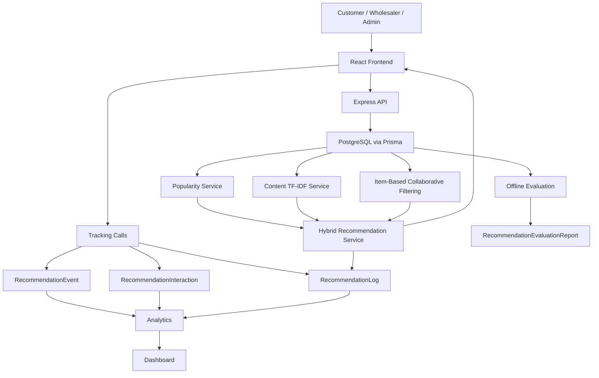
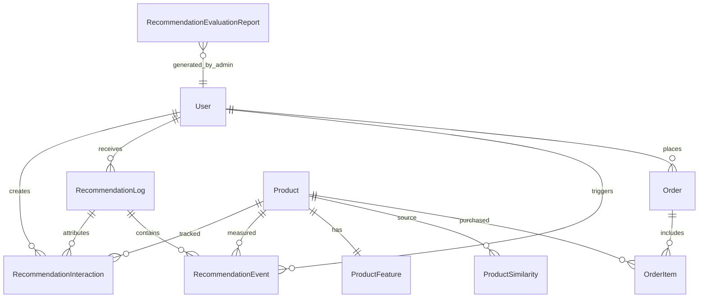
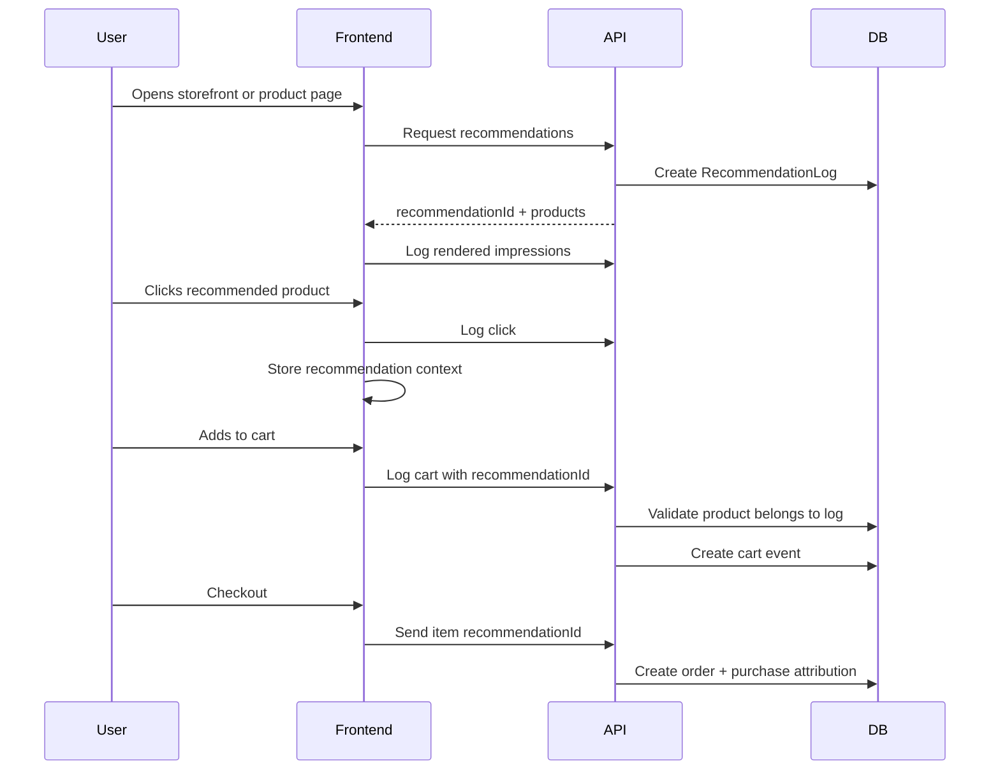

# NexCart Recommendation System Final Report

## 1. Architecture Diagram



## 2. Database ER Diagram



## 3. Recommendation Flow Diagram



## 4. Algorithm Explanation

NexCart uses a hybrid recommendation system with three main sources:

- Content-based filtering compares products using TF-IDF vectors built from product text.
- Item-based collaborative filtering compares products using weighted user interaction vectors.
- Popularity ranking scores products from views, carts, purchases, reviews, and time decay.

The hybrid service merges candidates, normalizes each source score to `0..1`, removes unavailable products, adds review quality, and ranks with fixed weights.

## 5. Data Preprocessing

Product text corpus is built from:

- name
- category
- description
- SKU
- sizes
- wholesaler business name

Preprocessing:

- lowercase text
- remove non-alphanumeric characters
- split by whitespace
- remove short tokens with length <= 2
- compute TF-IDF term weights
- store vectors as JSON in `ProductFeature`
- store top-K similarities in `ProductSimilarity`

## 6. Mathematical Formulas

TF-IDF:

```txt
tf(term, document) = term_count / total_terms
idf(term) = log((N + 1) / (df(term) + 1)) + 1
tfidf = tf * idf
```

Cosine similarity:

```txt
similarity(A, B) = dot(A, B) / (||A|| * ||B||)
```

Popularity:

```txt
score = sum(actionWeight * quantity * timeDecay)
timeDecay = 0.5 ^ (ageDays / halfLifeDays)
```

Hybrid score:

```txt
hybrid =
  content * 0.45 +
  collaborative * 0.30 +
  popularity * 0.20 +
  review * 0.05
```

Analytics:

```txt
CTR = clicks / impressions
Cart Rate = carts / impressions
Conversion Rate = purchases / impressions
Coverage = unique_recommended_products / total_products
```

## 7. API Documentation

Customer recommendation APIs:

- `GET /api/recommendations/popular?scope=trending|allTime&limit=12`
- `GET /api/recommendations/products/:id/similar?limit=8`
- `GET /api/recommendations/user?limit=12`
- `POST /api/interactions`
- `POST /api/interactions/recommendation-event`
- `POST /api/interactions/recommendation-events`

Protected operations:

- `GET /api/recommendations/analytics`
  - `WHOLESALER`, `SUPER_ADMIN`
- `GET /api/recommendations/health`
  - `WHOLESALER`, `SUPER_ADMIN`
- `GET /api/recommendations/evaluation`
  - `SUPER_ADMIN`
- `POST /api/recommendations/maintenance/clear-logs`
  - `SUPER_ADMIN`
- `POST /api/recommendations/maintenance/reset-evaluation`
  - `SUPER_ADMIN`
- `POST /api/recommendations/maintenance/reset-analytics`
  - `SUPER_ADMIN`

## 8. Deployment Guide

Backend:

```bash
cd apps/backend
npm install
npx prisma db push
npx prisma generate
npm run recommendations:build-content
npm run recommendations:build-cf
npm run dev
```

Frontend:

```bash
cd apps/frontend
npm install
npm run build
npm run dev
```

Recommended environment variables:

```txt
DATABASE_URL=
JWT_SECRET=
RECOMMENDATION_IMPRESSION_DEDUP_MINUTES=60
RECOMMENDATION_ATTRIBUTION_WINDOW_HOURS=24
```

## 9. Testing Guide

Backend checks:

```bash
cd apps/backend
npx prisma validate
npm run recommendations:test-access
npm run recommendations:benchmark
```

Syntax check:

```powershell
Get-ChildItem -Path src -Recurse -Filter *.js | ForEach-Object { node --check $_.FullName }
```

Frontend:

```bash
cd apps/frontend
npm run build
```

Manual demo checks:

- storefront logs rendered impressions
- recommendation click carries context
- add-to-cart creates attributed cart event
- checkout creates attributed purchase event
- analytics dashboard shows funnel and health
- customer cannot access analytics/evaluation
- wholesaler can access analytics but not evaluation
- admin can access analytics and evaluation

## 10. Viva Preparation Questions

1. Why did you choose a hybrid recommender?
2. Why is item-based collaborative filtering better than user-based filtering here?
3. How does TF-IDF work in your product similarity engine?
4. What is cosine similarity?
5. How do you handle cold-start products?
6. How do you prevent inflated impressions?
7. How do you attribute purchases to recommendations?
8. Why did you avoid embeddings/vector search in the final implementation?
9. What metrics prove recommendation quality?
10. What is the difference between offline evaluation and online analytics?
11. How does your system protect analytics from normal users?
12. What are the current limitations?
13. How would you scale this system later?
14. What happens if collaborative data is sparse?
15. How does the dashboard help evaluate business impact?
